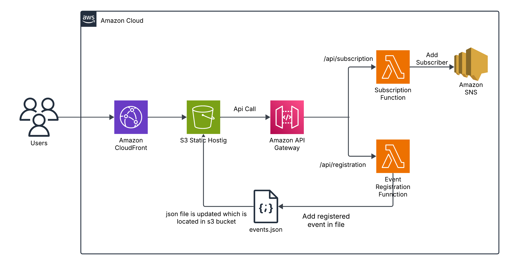

# 📨 Event Notification System on AWS

This project demonstrates how to build a **real-time event notification system** using AWS services including S3, CloudFront, API Gateway, Lambda, and SNS.

The system allows users to:
- View all upcoming events
- Subscribe via email for notifications
- Register new events that trigger real-time email alerts

## 📌 Overview

This is a serverless architecture that enables:
- Static website hosting with AWS S3 and CloudFront
- API integration using AWS API Gateway
- Backend logic using AWS Lambda
- Real-time email notifications via Amazon SNS

## 🧭 Architecture Diagram

## 📖 Full Step-by-Step Guide

For a detailed tutorial including setup, deployment, and code examples, follow this link:

👉 [Full Setup Instructions](https://github.com/kkarki7120/Devops-project-event-announcement-system/)

## 🛠️ Services Used

- Amazon S3  
- Amazon CloudFront  
- AWS Lambda  
- Amazon SNS  
- API Gateway  
- IAM Roles & Policies

